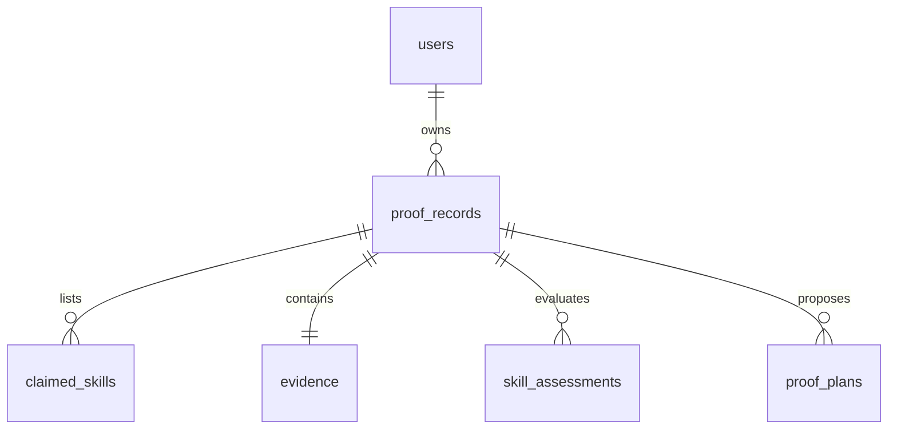

# PROVE — Architectural Documentation

## 1. Project Overview

**PROVE (Proof Builder & Evidence Intelligence)** is a technical platform designed to parse, verify, and score professional experience claims. In professional contexts, evaluating skill capability is traditionally subjective, relying on self-reported resumes or ungrounded credentials. PROVE addresses this by converting natural-language descriptions of project experience into concrete, structured, and verifiable evidence artifacts.

### Objectives
*   **Fact-Grounded Analysis:** Convert unstructured descriptions of professional tasks into a clean schema of actions, tools, outputs, and outcomes.
*   **Objective Skill Verification:** Map extracted facts to claimed skills using reproducible deterministic matching rules.
*   **Evidence Quality Assessment:** Compute evidence quality across seven distinct dimensions (Relevance, Depth, Ownership, Outcome, Verifiability, Recency, and Transferability) to combat resume exaggeration.
*   **Proof Gap Resolution:** Identify specific missing elements of proof for claimed skills and construct actionable development plans to address them.

### LLM + Deterministic Hybrid Architecture
The system employs a hybrid architecture combining Large Language Models (LLMs) with deterministic Python execution rules. 
*   **LLM Role:** Responsible for Natural Language Understanding (NLU). The LLM excels at extracting semantic entities (e.g., matching the action of "cleaning data" and identifying "Pandas" as a tool) from unstructured text, and generating realistic suggestions for project plans.
*   **Deterministic Python Role:** Responsible for scoring, skill mapping, gap matching, and persistence. By restricting the LLM to fact extraction and text generation, and letting Python execute the scoring formulas and status classification, PROVE eliminates AI hallucinations and ensures that evaluations are consistent, reproducible, and testable.

---

## 2. High-Level System Architecture

The diagram below represents the complete end-to-end data flow and component relationships inside PROVE:

```text
       User (Enters Experience, Claimed Skills, Links, Outcomes)
                               │
                               ▼
     ┌───────────────────────────────────────────────────┐
     │                  React Frontend                   │
     │        (TypeScript / Vite / Tailwind CSS)         │
     └─────────────────────────┬─────────────────────────┘
                               │ HTTP POST/GET (JSON)
                               ▼
     ┌───────────────────────────────────────────────────┐
     │                  FastAPI Backend                  │
     │                   (app/main.py)                   │
     └─────────────────────────┬─────────────────────────┘
                               │
                               ▼
     ┌───────────────────────────────────────────────────┐
     │                Request Validation                 │
     │             (Pydantic Input Schemas)              │
     └─────────────────────────┬─────────────────────────┘
                               │
                               ▼
     ┌───────────────────────────────────────────────────┐
     │           LLM Service Layer Abstraction           │
     │                   (LLMService)                    │
     └─────────────┬───────────────────────────┬─────────┘
                   │                           │
                   ▼ (LLM_PROVIDER=gemini)     ▼ (LLM_PROVIDER=mock)
     ┌───────────────────────────┐ ┌───────────────────────────┐
     │      GeminiProvider       │ │       MockProvider        │
     │  (gemini-3.6-flash API)   │ │  (Local Regex Fallback)   │
     └─────────────┬─────────────┘ └───────────┬───────────────┘
                   │                           │
                   └─────────────┬─────────────┘
                                 │
                                 ▼
     ┌───────────────────────────────────────────────────┐
     │          Structured Evidence Extraction           │
     │        (Actions, Tools, Outputs, Outcomes)        │
     └─────────────────────────┬─────────────────────────┘
                               │
                               ▼
     ┌───────────────────────────────────────────────────┐
     │          Deterministic Evaluation Engine          │
     │  ┌─────────────────────────────────────────────┐  │
     │  │ 1. Skill Mapping (PROVEN / IMPLIED /        │  │
     │  │    CLAIMED / UNPROVEN)                      │  │
     │  ├─────────────────────────────────────────────┤  │
     │  │ 2. L0–L5 Proficiency Level Evaluation       │  │
     │  ├─────────────────────────────────────────────┤  │
     │  │ 3. 7-Dimension Evidence Scoring             │  │
     │  ├─────────────────────────────────────────────┤  │
     │  │ 4. Proof Gap Analysis                       │  │
     │  ├─────────────────────────────────────────────┤  │
     │  │ 5. Proof Builder (Plan Generation)          │  │
     │  └─────────────────────────────────────────────┘  │
     └─────────────────────────┬─────────────────────────┘
                               │
                               ▼
     ┌───────────────────────────────────────────────────┐
     │         SQLite Database (SQLAlchemy ORM)          │
     │  (users, proof_records, claimed_skills, evidence, │
     │   skill_assessments, proof_plans)                 │
     └─────────────────────────┬─────────────────────────┘
                               │
                               ▼
                     Proof Artifact Output
             (JSON API Response -> Frontend UI)
```

---

## 3. Technology Stack

PROVE utilizes a modern, lightweight, and type-safe technology stack:

| Layer | Technology | Purpose |
| :--- | :--- | :--- |
| **Frontend** | React 18 / TypeScript | Builds a modular, component-based user interface with strict state types. |
| **Frontend Build** | Vite | Serves as the bundler and fast-reloads development environments. |
| **Styling** | Tailwind CSS | Utility-first CSS framework for clean, responsive, glassmorphic styling. |
| **Backend REST API** | FastAPI | High-performance, asynchronous Python web framework for REST API routing. |
| **Runtime** | Python 3.12 | Core execution environment for the backend code. |
| **Data Validation** | Pydantic v2 | Enforces static data validation schemas on REST requests and responses. |
| **Config Loader** | Pydantic Settings | Dynamically loads configuration and credentials from environment variables (`.env`). |
| **ORM** | SQLAlchemy | Maps database queries and schema definitions to Python models. |
| **Database** | SQLite | Serverless, file-based relational database used for local persistence (`prove.db`). |
| **LLM Integration** | Google GenAI SDK | Interfaces with the Gemini API (using the active `gemini-3.6-flash` model). |
| **Testing** | pytest | Automated unit, integration, scoring, and evaluation testing. |

---

## 4. Frontend Architecture

The client application is organized inside the `frontend/` directory.

### UI Component Layout
The core modular interfaces are found in `frontend/src/components/`:
*   `Header.tsx`: Renders the main dashboard header, exposes the current backend model provider (`mock` or `gemini`), and contains a reset trigger.
*   `ProofInputForm.tsx`: Renders the primary experience entry form, collecting target domain details, claimed skills, descriptions, external links, outcomes, and AI-usage declarations.
*   `LoadingProgress.tsx`: Displays real-time progress steps during asynchronous backend execution with animated visual ticks (Extraction, Skill Mapping, Scored Verification, Gap Analysis, Plan Building).
*   `AnalysisResults.tsx`: Displays high-level summaries of the analysis result upon pipeline completion.
*   `SkillAssessmentCards.tsx`: Renders structured grids showing each claimed skill's verified status (`PROVEN`, `IMPLIED`, `CLAIMED`, `UNPROVEN`), proficiency levels (L0–L5), and text justifications.
*   `EvidenceQualityBreakdown.tsx`: Renders a detailed breakdown of the 7 scoring dimensions alongside the final quality label classification.
*   `ProofGapSection.tsx`: Highlights missing evidence requirements for non-proven skills, exposing actionable links to build targeted proof plans.
*   `ProofBuilderSection.tsx`: Shows generated plans, listing recommended activities, deliverables, and estimated efforts.
*   `ProofArtifactView.tsx`: Displays the copyable JSON structure of the compiled Proof Artifact.

### General Frontend Flow
```text
User Input Form
  │
  ▼
API Request (POST /api/proof/analyze)
  │
  ▼
Loading State Progress Indicator (LoadingProgress.tsx)
  │
  ▼
Analysis Result Handled & Spread (App.tsx)
  │
  ├─► Skill Assessment Cards (SkillAssessmentCards.tsx)
  ├─► Evidence Quality Scores (EvidenceQualityBreakdown.tsx)
  ├─► Proof Gaps List (ProofGapSection.tsx)
  ├─► Proof Builder Plan (ProofBuilderSection.tsx)
  └─► JSON Raw Artifact Display (ProofArtifactView.tsx)
```

---

## 5. Backend Architecture

The server application is structured under the `backend/` directory.

### Key Files and Layout
*   `app/main.py`: Entrypoint. Initializes the FastAPI app, triggers SQLite schema setup on startup via lifespan hooks, configures CORS, and exposes the `/api/health` health check.
*   `app/api/routes/proof.py`: Houses REST endpoint controllers, mapping routes to pipeline steps, and managing database transaction scopes.
*   `app/schemas/`: Handles structural definitions:
    *   `proof.py`: Request payloads (`ProofAnalysisRequest`, `ProofBuildPlanRequest`) and response wrappers (`ProofAnalysisResponse`, `ProofArtifact`).
    *   `evidence.py`: Holds `ExtractedEvidence` properties.
    *   `assessment.py`: Holds `SkillAssessment`, `EvidenceQuality`, and `ProofPlan` schemas.
*   `app/services/`: Modular pipeline logic:
    *   `llm_service.py`: Exposes `BaseLLMProvider` and resolves factory bindings.
    *   `gemini_provider.py`: Communicates with Google's Gemini models using the current API SDK.
    *   `mock_provider.py`: Regex extraction parsing matching known verbs and tools to support local runs.
    *   `evidence_extractor.py`: Executes the extraction step against the selected provider.
    *   `skill_mapper.py`: Executes deterministic mapping logic (classification and L1–L4 evaluation).
    *   `evidence_scorer.py`: Computes 7-dimension metrics and penalty guardrails.
    *   `proof_gap.py`: Generates custom gap texts for unverified credentials.
    *   `proof_builder.py`: Compiles action plans to resolve gaps.
*   `app/db/`: Persistence layers:
    *   `database.py`: Establishes DB sessions (`get_db`) and initializes file schemas (`init_db`).
    *   `models.py`: Defines SQLAlchemy database structures.
*   `app/core/config.py`: Loads environment configurations.
*   `app/prompts/`: Unstructured text prompts loaded by the Gemini model provider.

### Lifecycle of a Backend Request
1.  **Request Input Validation:** Payload validated via Pydantic schemas.
2.  **LLM/Mock Fact Extraction:** The experience text is converted into structured JSON arrays of actions, tools, outputs, and outcomes.
3.  **Deterministic Skill Mapping:** Extracted tools/actions are evaluated against synonyms and pronoun ownership rules to categorize skill statuses.
4.  **Deterministic Quality Scoring:** Calculates the overall quality score by applying mathematical weights and short-text penalties.
5.  **Proof Gap Mapping:** Populates targeted gap requirements for non-proven skills.
6.  **Proof Plan Compilation:** Generates actionable projects and deliverables.
7.  **SQLite Persistence:** Stores records in relational tables.
8.  **Artifact Output Serialization:** Sends the compiled `ProofArtifact` response back to the client.

---

## 6. API Architecture

PROVE implements the following backend endpoints:

| Method | Endpoint | Purpose | Input / Output Summary |
| :--- | :--- | :--- | :--- |
| `GET` | `/api/health` | Inspects system status, active LLM provider, and database state. | **Output:** Status JSON containing `"status": "ok"` and active configuration details. |
| `POST` | `/api/proof/analyze` | Executes the complete PROVE analysis pipeline and saves results. | **Input:** `ProofAnalysisRequest` JSON containing experience details and claimed skills.<br>**Output:** `ProofAnalysisResponse` containing record ID, extracted evidence, skill assessment results, and the finalized `ProofArtifact`. |
| `POST` | `/api/proof/build` | Generates a custom project plan to close a specific skill proof gap. | **Input:** `ProofBuildPlanRequest` JSON stating the target skill name and the identified gap.<br>**Output:** `ProofPlan` JSON containing activities, deliverables, and estimated efforts. |
| `GET` | `/api/proof/{id}` | Retrieves a previously saved proof analysis record by database ID. | **Output:** `ProofAnalysisResponse` JSON containing the fully reconstructed `ProofArtifact`. |
| `GET` | `/api/proof` | Lists metadata for the 50 most recent saved analysis records. | **Output:** A JSON list of records containing ID, target role, claimed skills, quality label, and date. |

---

## 7. LLM Provider Architecture

PROVE uses the provider pattern to isolate the application core from external API clients.

```text
                        LLMService (Resolver Factory)
                                     │
                                     ▼
                              BaseLLMProvider
                               /           \
                              /             \
                             ▼               ▼
                      GeminiProvider   MockProvider
```

*   `BaseLLMProvider`: Defines standard interfaces that both providers must implement: `extract_evidence()` and `generate_proof_plan()`.
*   `LLMService`: Directs traffic. If `LLM_PROVIDER=gemini` is set in configuration and a valid `GEMINI_API_KEY` is present, it returns `GeminiProvider`; otherwise, it falls back to `MockProvider`.
*   `GeminiProvider`: Integrates with Google's GenAI API. It targets the active model **`gemini-3.6-flash`**. Requests are retried up to two times upon failure. If all retries fail, it logs warnings and falls back to `MockProvider` so that application processing is not blocked.
*   `MockProvider`: Handles offline execution. It runs local regular expression matching to extract tools, actions, outputs, and outcomes from the user text, and resolves plans using preconfigured mock templates.

---

## 8. Evidence Extraction Pipeline

The extraction pipeline converts unstructured text into a validated JSON schema of facts:

### Target Schema Categories
*   **Actions:** Activities or steps executed (e.g., "designed database schemas").
*   **Tools:** Platforms, databases, languages, or libraries utilized (e.g., "FastAPI", "SQLite").
*   **Outputs:** Hard artifacts created (e.g., "REST API", "cleaned dataset").
*   **Outcomes:** Quantitative or qualitative results (e.g., "reduced query latency by 30%").

### Extraction Flow
1.  Unstructured text is loaded into a prompt template and sent to the LLM or Mock Provider.
2.  The response is returned as a JSON structure.
3.  The structure is parsed into the `ExtractedEvidence` Pydantic model. If validation fails or rate limits (HTTP 429) occur, the Gemini provider attempts retries before falling back to local regular expression parsing.

> **Example Pipeline Run**
> *   **Input Text:** *"I automated ETL pipelines using Python and SQL. This decreased dashboard load times by 20%."*
> *   **Extracted Evidence (JSON):**
>     ```json
>     {
>       "actions": ["automated ETL pipelines", "decreased dashboard load times"],
>       "tools": ["Python", "SQL"],
>       "outputs": ["ETL pipelines"],
>       "outcomes": ["decreased dashboard load times by 20%"]
>     }
>     ```

---

## 9. Deterministic Skill Mapping

The skill mapping engine is implemented in `skill_mapper.py`. It maps claimed skills to verification statuses using strict rules instead of relying on the LLM to make the decision.

### Skill Synonyms
The engine maps claimed skill names to alternative names using a preconfigured synonyms map:
*   `python` maps to: `python`, `pandas`, `numpy`, `scikit-learn`, `py`, `pytest`, `fastapi`, `django`, `flask`.
*   `sql` maps to: `sql`, `queries`, `query`, `postgresql`, `mysql`, `sqlite`, `sql server`, `database`.
*   `excel` maps to: `excel`, `xlsx`, `spreadsheet`, `pivot`, `xlookup`, `vlookup`, `csv`.

### Verification Statuses
*   **PROVEN:** Direct evidence demonstrates personal practical usage. Requires matching action/tool synonyms and personal pronoun ownership, with no conflicting team-only indicators.
*   **IMPLIED:** The skill is mentioned in context, but direct personal execution is ambiguous (e.g., matching team-only rules or occurring only in passive descriptions).
*   **CLAIMED:** The user claimed proficiency in the skill, but the experience text contains no matching tools, actions, or outputs.
*   **UNPROVEN:** Default baseline state signifying a complete lack of supporting evidence.

### Personal vs. Team-Only Guardrails
To prevent users from claiming credit for work performed by others, the engine checks text fragments for team context. If action statements contain team pronouns (`"we"`, `"our"`, `"the team"`, `"company"`) and lack personal pronouns (`"I"`, `"my"`, `"me"`), the skill status is set to **IMPLIED** instead of **PROVEN**, and a proof gap is flagged.

---

## 10. L0–L5 Proficiency Model

PROVE translates verification strength into proficiency levels using the following model:

| Level | Name | Description / Conditions |
| :--- | :--- | :--- |
| **L0** | No Evidence | No information or claims are available for this skill. |
| **L1** | Awareness / Basic Exposure | Skill is claimed by the user, but no evidence was found in the text. (Assigned to **CLAIMED** status). |
| **L2** | Basic Practical Usage | Skill is mentioned, but personal execution is ambiguous, OR it has minimal actions with no outcomes/outputs. (Assigned to **IMPLIED** status or basic **PROVEN** status). |
| **L3** | Independent Practical Usage | Skill is **PROVEN** with matching actions and outputs, or outcomes, or valid external evidence links. |
| **L4** | Advanced / Complex Application | Skill is **PROVEN** with matching actions, valid evidence links, and clear quantitative outcomes. |
| **L5** | Expert / Deep Ownership | Conceptual level representing architectural design and mentorship (requires manual validation or certified credentials). |

---

## 11. Evidence Quality Scoring

The `EvidenceScorer` evaluates evidence quality across seven dimensions, applying the following weights:

| Dimension | Weight | Scoring Condition |
| :--- | :--- | :--- |
| **Relevance** | 20% | Alignment of extracted actions/tools with the target role and domain. |
| **Depth** | 15% | Count and richness of extracted tools, actions, and outputs. |
| **Ownership** | 15% | Evaluation of personal pronouns vs. team keywords in text. |
| **Outcome** | 15% | Presence of concrete business results (with a bonus for numerical metrics). |
| **Verifiability** | 15% | Presence of valid source links (GitHub, GitLab) and descriptions. |
| **Recency** | 10% | Presence of legacy context (penalizes older dates/tech). |
| **Transferability** | 10% | Count of cross-functional transferable technologies (e.g., SQL, Git, Python). |

### Score Calculation and Labeling
The final quality score is computed using the weighted sum of these dimensions:
$$\text{Overall Score} = (R \times 0.20) + (D \times 0.15) + (O \times 0.15) + (Oc \times 0.15) + (V \times 0.15) + (Re \times 0.10) + (T \times 0.10)$$

The overall score is mapped to one of four quality labels:
*   **Very Strong:** Score $\ge 85.0$
*   **Strong:** $70.0 \le \text{Score} < 85.0$
*   **Moderate:** $40.0 \le \text{Score} < 70.0$
*   **Weak:** Score $< 40.0$

### Brief-Text Penalties
If the experience text is very brief (less than 60 characters) and lists no tools, a penalty is applied to prevent high scores: Relevance is capped at 30.0, Depth at 20.0, Ownership at 40.0, Recency at 40.0, and Transferability at 30.0.

---

## 12. Proof Gap Analysis

Proof gap analysis identifies what evidence is missing for claimed skills:
*   **Role of `proof_gap.py`:** It scans the skill assessments. For non-proven skills (`CLAIMED`, `IMPLIED`, `UNPROVEN`), it populates a targeted gap explanation in `SkillAssessmentModel.proof_gap`.
*   **Examples:**
    *   **CLAIMED Gap:** *"No direct code, script, dashboard, or project deliverable was supplied to verify Python. Construct a hands-on project artifact demonstrating practical implementation."*
    *   **IMPLIED Gap:** *"Skill SQL is implied by context, but lacks concrete output deliverables or repository links. Publish an open repository or dataset showing specific execution."*

---

## 13. Proof Builder

The Proof Builder generates project-based recommendations to close identified proof gaps.

### Structured Fields
Each generated plan contains:
*   `activity`: A description of the project task.
*   `why_it_closes_gap`: Explanation of how the project addresses the gap.
*   `deliverables`: A list of artifacts to build (e.g., Python scripts, SQL schemas, dashboards).
*   `evidence`: The platform or medium where the evidence should be hosted (e.g., GitHub repository, DB Fiddle).
*   `skills`: The skills verified by completing the project.
*   `suggested_source`: Suggested data or hosting platforms (e.g., Kaggle, GitHub).
*   `difficulty`: The estimated skill level required (e.g., Intermediate, Beginner).
*   `estimated_effort`: The expected duration to complete the task (e.g., 5-10 hours).

### Rationale
While the natural-language text for these plans is generated by the LLM (or mock templates in offline mode), the schema structure is enforced by FastAPI and Pydantic validation rules.

---

## 14. Database Architecture

PROVE uses SQLite and SQLAlchemy ORM to persist data.



### Relational Table Structures

| Model / Table | Purpose | Primary Data Fields |
| :--- | :--- | :--- |
| **`User`** (`users`) | Stores user identities. | `id` (PK), `name`, `email`, `created_at` |
| **`ProofRecord`** (`proof_records`) | The main transactional log of the analysis. | `id` (PK), `user_id` (FK), `target_role`, `target_domain`, `experience_description`, `project_name`, `project_description`, `outcome`, `evidence_links`, `evidence_description`, `ai_usage`, `created_at` |
| **`ClaimedSkill`** (`claimed_skills`) | Claims submitted by the user. | `id` (PK), `proof_record_id` (FK), `skill_name` |
| **`EvidenceItem`** (`evidence`) | Extracted facts and quality scores. | `id` (PK), `proof_record_id` (FK, Unique), `extracted_actions_json`, `extracted_tools_json`, `extracted_outputs_json`, `extracted_outcomes_json`, `overall_score`, `quality_label`, `relevance_score`, `depth_score`, `ownership_score`, `outcome_score`, `verifiability_score`, `recency_score`, `transferability_score` |
| **`SkillAssessmentModel`** (`skill_assessments`) | Persisted evaluation details for each skill. | `id` (PK), `proof_record_id` (FK), `skill_name`, `status` (PROVEN/IMPLIED/CLAIMED), `proficiency_level`, `proficiency_name`, `justification`, `proof_gap` |
| **`ProofPlanModel`** (`proof_plans`) | Propose actionable plans to close gaps. | `id` (PK), `proof_record_id` (FK), `skill_name`, `activity`, `why_it_closes_gap`, `deliverables_json`, `evidence_source`, `skills_json`, `suggested_source`, `difficulty`, `estimated_effort`, `created_at` |

---

## 15. Data Flow

The diagram below details how data moves through the system during a proof analysis:

```text
       [React Frontend Form]  ◄───────────────────────────┐
                 │                                        │
                 ▼ (POST /api/proof/analyze)              │
       [FastAPI Main Router]                              │
                 │                                        │
                 ▼                                        │
       [Pydantic Schema Validation]                       │
                 │                                        │
                 ▼                                        │
       [LLM Abstraction Layer]                            │
                 │                                        │
      ┌──────────┴──────────┐                             │
      ▼ (LLM_PROVIDER=gemini) ▼ (LLM_PROVIDER=mock)       │
[Gemini Provider]     [Mock Regex Provider]               │
      └──────────┬──────────┘                             │
                 │                                        │
                 ▼ (Extracted Evidence JSON)              │
       [Skill Mapper (synonym/ownership rules)]           │
                 │                                        │
                 ▼                                        │
       [Evidence Scorer (weighted formulas)]              │
                 │                                        │
                 ▼                                        │
       [Proof Gap Engine (gap mapping)]                   │
                 │                                        │
                 ▼                                        │
       [Proof Plan Service (activity building)]           │
                 │                                        │
                 ▼                                        │
       [SQLAlchemy ORM Transaction]                       │
                 │                                        │
                 ▼                                        │
       [SQLite Database Persistence]                      │
                 │                                        │
                 ▼ (ProofArtifact Response)               │
       [JSON API Output] ─────────────────────────────────┘
```

---

## 16. Deterministic Logic vs. LLM Responsibility

Responsibilities are separated between the LLM and the Python application layer:

| System Responsibility | LLM Provider | Deterministic Python Engine |
| :--- | :---: | :---: |
| **Natural Language Understanding (NLU)** | ✓ | |
| **Entity Extraction (Actions, Tools, Outputs)** | ✓ | |
| **Skill Classification (Proven, Implied, Claimed)** | | ✓ |
| **Proficiency Level Assignment (L0–L5)** | | ✓ |
| **Dimension Score Calculations (Relevance, Depth, etc.)** | | ✓ |
| **Ownership Check & Pronoun Analysis** | | ✓ |
| **Proof Gap Flag Matching** | | ✓ |
| **Contextual Project Plan Text Generation** | ✓ | |
| **Relational Database Persistence (SQLAlchemy)** | | ✓ |

### Why This Separation Matters
This hybrid design ensures that scoring and skill verification are consistent. By preventing the LLM from assigning final scores or classifications directly, PROVE ensures that assessments are audit-ready, testable, and free from AI rating drift.

---

## 17. Guardrails and Reliability

PROVE implements the following safeguards:
*   **Payload Validation:** Pydantic validation rejects incomplete or malformed requests before calling downstream services.
*   **Structured Output Contracts:** Enforces that LLM outputs conform to JSON schemas.
*   **Failure Recovery:** Retries failed LLM requests and falls back to MockProvider when quotas are exhausted.
*   **Factual Scoring Guardrails:** Applies penalties to short or generic experience texts to prevent inflated scores.
*   **Ambiguity Flags:** Downgrades team-only activities to IMPLIED status if personal participation is not confirmed in the text.
*   **Verifiability Limits:** Caps quality scores if no valid source links are provided.

---

## 18. Testing Architecture

The project uses `pytest` to run its automated test suite, which is organized under the `backend/tests/` directory:

*   `test_extraction.py`: Verifies tool, action, output, and outcome parsing.
*   `test_skill_mapping.py`: Validates skill categorization rules.
*   `test_evidence_scoring.py`: Tests the 7-dimension scoring formulas and penalties.
*   `test_proof_gap.py`: Asserts that gap explanations are generated correctly.
*   `test_proof_builder.py`: Verifies project plan generation.
*   `test_api.py`: Tests REST endpoint responses and database retrieval.
*   `test_evaluation_cases.py`: Runs assertion checks against the scenarios in `evaluation_cases.json`.

### Test Execution Summary
Running the test suite locally with `LLM_PROVIDER=mock` executes **20 automated tests**, all of which pass:

```text
tests/test_api.py::test_health_check PASSED
tests/test_api.py::test_analyze_proof_success PASSED
tests/test_api.py::test_analyze_proof_validation_failure PASSED
tests/test_api.py::test_build_plan_api PASSED
tests/test_evaluation_cases.py::test_evaluation_case[CASE_1] PASSED
tests/test_evaluation_cases.py::test_evaluation_case[CASE_2] PASSED
tests/test_evaluation_cases.py::test_evaluation_case[CASE_3] PASSED
tests/test_evaluation_cases.py::test_evaluation_case[CASE_4] PASSED
tests/test_evaluation_cases.py::test_evaluation_case[CASE_5] PASSED
tests/test_evaluation_cases.py::test_evaluation_case[CASE_6] PASSED
tests/test_evaluation_cases.py::test_evaluation_case[CASE_7] PASSED
tests/test_evaluation_cases.py::test_evaluation_case[CASE_8] PASSED
tests/test_evidence_scoring.py::test_7_dimension_evidence_scoring PASSED
tests/test_evidence_scoring.py::test_unsupported_numerical_claim_verifiability PASSED
tests/test_extraction.py::test_mock_extraction_basic PASSED
tests/test_extraction.py::test_mock_extraction_empty PASSED
tests/test_proof_builder.py::test_proof_builder_plan_generation PASSED
tests/test_proof_gap.py::test_proof_gap_generation PASSED
tests/test_skill_mapping.py::test_skill_mapping_proven_and_claimed PASSED
tests/test_skill_mapping.py::test_skill_mapping_implied PASSED

======================= 20 passed in 1.02s =======================
```

---

## 19. Evaluation Cases

The file `tests/evaluation_cases.json` acts as a golden dataset of test scenarios:

*   `CASE_1` (Strong Evidence - Senior Data Engineer): Validates that Python and SQL are mapped to **PROVEN** status and overall quality is rated as Strong/Very Strong when valid links and metrics are provided.
*   `CASE_2` (Claimed Skill Without Evidence): Asserts that Excel and SQL are mapped to **PROVEN**, while Python is set to **CLAIMED** with an active proof gap.
*   `CASE_3` (Weak Evidence): Tests that brief experience texts receive a **Weak** quality label and a low overall score.
*   `CASE_4` (Unsupported Numerical Claim): Confirms that claims of "40% revenue growth" are not mapped to PROVEN status if they are unsupported by actions or tools, and that verifiability scores are capped.
*   `CASE_5` (Mixed Evidence): Tests that React, Python, and FastAPI are mapped to **PROVEN**, while Kubernetes is set to **CLAIMED**.
*   `CASE_6` (AI-Assisted Project): Checks that AI-generated projects are parsed correctly and labeled with AI usage metadata.
*   `CASE_7` (Insufficient Experience Text): Validates that extremely short inputs (less than 5 characters) fail request validation.
*   `CASE_8` (Conflicting or Ambiguous Evidence): Asserts that team-only migrations map Rust to **IMPLIED** status, while personal scripting tasks map Python to **PROVEN**.

---

## 20. Deployment Architecture

PROVE is designed as a decoupled application and can be deployed on the Render cloud platform using the project's `render.yaml` configuration:

```text
                              Internet
                                 │
                                 ▼
                     ┌───────────────────────┐
                     │    React Frontend     │
                     │  prove-frontend static│
                     └───────────┬───────────┘
                                 │
                                 │ HTTPS / JSON
                                 ▼
                     ┌───────────────────────┐
                     │    FastAPI Backend    │
                     │   prove-backend web   │
                     └───────────┬───────────┘
                                 │
                       ┌─────────┴─────────┐
                       ▼                   ▼
                  Gemini API             SQLite
               (gemini-3.6-flash)      Local Disk
```

### Deployed Resources
*   **Static Frontend:** Renders the React single-page app from the `dist` folder. (URL: `https://prove-frontend.onrender.com/`).
*   **Web API Backend:** Exposes the FastAPI application using Uvicorn. (URL: `https://prove-backend.onrender.com/`).
*   **Health Check Endpoint:** Exposes a health check route at `/api/health`.
*   **Persistence:** Stores data in a local SQLite database (`prove.db`).
*   **LLM API:** Connects to the Gemini API using `gemini-3.6-flash`.

---

## 21. Security and Configuration

*   **Configuration Files:** Configuration is managed using `app/core/config.py` and loaded from the environment or a local `.env` file.
*   **Environment Variables:**
    *   `LLM_PROVIDER`: Selects the active provider (e.g., `gemini` or `mock`).
    *   `GEMINI_API_KEY`: API key for Gemini.
    *   `DATABASE_URL`: Connection string for the database (defaults to `sqlite:///./prove.db`).
*   **Git Safety:** The file `.gitignore` is configured to exclude sensitive files (such as `.env`, local `.venv` environments, test caches, and the `prove.db` database) to prevent committing credentials to source control.

---

## 22. Design Decisions

*   **FastAPI:** Selected for its asynchronous capabilities, fast routing, automated Pydantic schema validation, and self-documenting Swagger interface.
*   **React + TypeScript:** Selected to build a modular UI with type safety matching backend schemas.
*   **SQLite:** Selected as a zero-administration, file-based database that simplifies local development, testing, and deployments.
*   **Provider Abstraction:** Selected to prevent coupling to a single LLM API, making it easier to integrate other models in the future.
*   **MockProvider:** Selected to support offline development and fast, reliable test execution without API dependencies.
*   **Deterministic Evaluation:** Selected to ensure that skill scoring is consistent, reproducible, and verifiable.
*   **Pydantic Schema Boundaries:** Selected to enforce strict data contracts at the boundaries of the API.
*   **Modular Services:** Implements the Single Responsibility Principle, separating parsing, mapping, scoring, and plan building.
*   **Database Persistence:** Selected to persist analysis history, enabling users to audit previous evaluations.

---

## 23. Limitations

*   **Gemini Free Tier Quotas:** The Gemini free tier has rate limits. When these limits are reached, the system falls back to `MockProvider`.
*   **NLU Extraction Dependencies:** The accuracy of skill mapping depends on how well the LLM extracts tools and actions from the experience description.
*   **SQLite Scaling Limits:** Because SQLite locks the database during writes, it is not suited for high-volume, concurrent production workloads.
*   **MockProvider Parsing limits:** The MockProvider uses simple regular expression patterns and is less flexible than the LLM when parsing complex or unusual language.

---

## 24. Future Improvements

*   **Production Database:** Migrate to PostgreSQL for concurrent production workloads.
*   **Authentication and Authorization:** Implement user registration, logins, and API keys.
*   **Automated Ingest Pipelines:** Import code and commits directly from the GitHub API to automate evidence collection.
*   **Background Processing queues:** Run LLM requests in the background using task queues (such as Celery or Redis) to improve API response times.
*   **Expanded Observability:** Integrate performance monitoring and tracing tools (such as OpenTelemetry).
*   **Certified Third-Party Integrations:** Integrate with third-party platforms to verify skills automatically.

---

## 25. Project Submission Notes

*   **Project Name:** PROVE — Proof Builder & Evidence Intelligence.
*   **Artifacts:** Includes API code, a React frontend, a test suite with 20 automated tests, `evaluation_cases.json`, and deployment configuration (`render.yaml`).
*   **AI Development Disclosure:** AI tools were used during development to assist with coding, debugging, test generation, and documentation. The core scoring calculations, skill mapping rules, database schemas, and API routers were reviewed and verified manually.

---

## 26. Conclusion

PROVE provides a structured, objective approach to verifying professional skills. By combining an LLM-based parsing layer with a deterministic Python scoring engine, PROVE converts unstructured experience descriptions into verifiable evidence, helping users identify and resolve proof gaps.